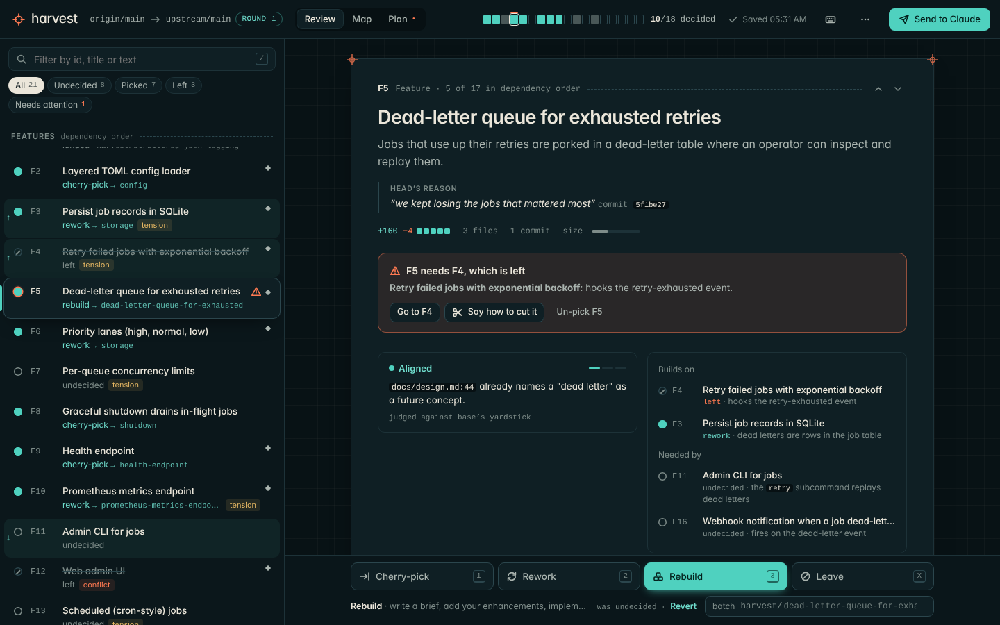

# Harvest review page, round 2

**Status: still a prototype, not integrated into `skills/harvest/`.** Branch `prototype/harvest-report`,
in `prototypes/harvest-report/v2/`. Round 1 (`../WRITEUP.md`, `../report-template.html`) is unchanged.

Round 1 showed that the page works. Round 2 asks whether people would want to use it: would someone
reviewing a 20-feature ledger choose the page over chat? I kept round 1's protocol, replaced its
interface, and tested the new one end to end.



## 1. Summary

- **What changed:** round 1 was a six-column table with marking controls in every row. Round 2 is a
  **review queue**: a list of entries in dependency order on the left, and the selected entry on the
  right with a decision dock at the bottom. Two more views sit beside it: a **dependency map** and a
  **plan** of the branches that will land. Every decision has a keyboard shortcut and can be undone.
  Handing the round back is one button, **Send to Claude**.
- **What did not change:** the ledger is still the source of truth, `render_report.py` and the
  `harvest-responses/1` schema are untouched, and the page is still one offline file with no
  framework. The test drives v2 through the same decisions as v1's test and checks that the exported
  file equals v1's `out/responses.json`, timestamps aside. It does.
- **Evidence:** `test_v2.py` makes 46 checks across round 1, round 2, a phone viewport and a
  40-entry ledger, and they all pass. Writing it surfaced one real bug, which I fixed (section 5).
  Firefox, Safari, screen readers and a human tester are still untested (section 6).

## 2. Audit of round 1

I read the write-up, the template, the renderer, both test drivers, the screenshots and the skill. My
verdict on each recommendation and open question follows. I agreed with most of the findings and
disagreed with some of the proposed fixes.

### Recommendations

| Round-1 recommendation | Verdict | Why |
|---|---|---|
| Ledger is the single source of truth; the page writes a separate responses file | **Keep** | This is what makes the page safe. Agents are good at ingesting a file, and the file is easy to audit. |
| Fixed template plus a stdlib renderer; the agent never hand-writes HTML | **Keep** | It's the only way the page can be good *and* reliable. v2 is one template file; the agent's job doesn't change. |
| `harvest-responses/1` schema, derived data left out | **Keep, unchanged** | It's minimal and correct. v2 derives batches, landing order and warnings on the page; none of it is exported. |
| localStorage draft + **Copy** as the primary hand-off | **Agree, and go further** | The human shouldn't have to pick among three save buttons. v2 has one primary action, **Send to Claude**. It opens a sheet with a summary and one large *Copy for Claude* button. Download and file sync are secondary links in that sheet. |
| File System Access as an optional extra | **Keep, hide it** | The value is real (a silent rewrite), but it only works in Chromium and the handle needs a permission re-grant. v2 moves it from the toolbar to the send sheet and the ⋯ menu. |
| Name the download `responses-r<round>.json` | **Done** | A plain `responses.json` will collide in Downloads by round 2. |
| Ledger-format tightening (§6 of round 1) | **Agree, out of scope** | Header keys, ids for set-aside items, a `Notes:` format and `Depends on:` syntax all help with or without the page. They belong in `SKILL.md`, so I left them alone. |
| Ship as `assets/` + `scripts/` + `references/REPORT.md` | **Agree** | The v2 template drops into the same place. |

### Round 1's open questions

1. **Table or list/board?** Neither. The job is triage: read one feature closely, decide, move on. A
   table puts 20 rows of controls on screen and gives each one too little room. A board organises
   entries by state, but the human needs dependency order. v2 uses the pattern of a mail client or
   code-review tool: a dense list for orientation and a single wide pane for focus. The list keeps
   dependency order. Selecting an entry tints the rows it builds on (↑) and the rows that need it (↓),
   so the structure shows up only where it's relevant.
2. **Mark inline or in the expanded panel?** In the panel, but never out of reach. The decision dock
   is pinned to the bottom of the detail pane, so it stays put while you scroll. The list only shows
   results (state dot, mode, batch). Round 1's rows mixed controls with results and caused misclicks,
   and v2 avoids that.
3. **How to show dependency problems?** Make them **actionable where you are**, and show the whole set
   once. On the entry, a card says "F5 needs F4, which is left", gives the reason from the ledger, and
   offers *Go to F4*, *Say how to cut it* and *Un-pick F5*. The entry it depends on gets a matching
   info card. Across the ledger, the problem appears as a "Needs attention" filter, a red tick on the
   progress bar, a red dashed edge on the map, and a panel on the plan view. Round 1 used tags only.
   They were accurate but gave you no way to resolve anything.
4. **What belongs in the sticky header?** Only what changes your next action: where you are
   (head → base, round), how far along you are, and **Send**. v2's header is 56 px against round 1's
   ~130 px. Import, download, file sync, theme and ledger info moved into the ⋯ menu.
5. **Composer placement?** Always visible on the selected entry, under its thread, with `C` to jump
   there. Round 1's question/note radio became two buttons, **Ask** (Ctrl+Enter) and **Add note**
   (Shift+Ctrl+Enter). A comment can switch kind after the fact, and you can edit it in place.
6. **Is round 2's "what's new" clear?** In round 1 it wasn't. In v2, a banner says "Claude answered
   3 questions from round 1 · Read them (2 new)". Answered entries carry a dot until you open them.
   The answer appears in a thread beneath your question with a **New** badge. The page opens on the
   first unread answer. Marks carried over from the ledger say "from the ledger" in the dock. A change
   you make this round says "was undecided · Revert".
7. **Three save paths without making the human choose?** See *Copy as primary* above: one button, a
   summary, a three-step strip (copy, paste into your Claude session, Claude answers and renders the
   next round), and the alternatives below a divider.

### Known rough edges from round 1, resolved

| Round-1 rough edge | v2 |
|---|---|
| 130 px header | 56 px, one row |
| "changed" tag on every touched row | a small ◆ in the row's flags; "was … · Revert" in the dock |
| Mark column wraps to two lines | four equal 40 px buttons in the dock, each with its key |
| Row heights jump when you mark | rows are a fixed two lines; marking changes text, not layout |
| Click-anywhere-to-toggle misclicks | a row click only selects; controls live in the dock |
| Every keystroke re-renders the table (focus hack) | typing never re-renders the field you're in; only the list and header follow |
| Comments can't be edited | Edit, Make note/question, Delete, all undoable |
| No keyboard shortcuts | `J/K`, `1/2/3/X`, `N` next undecided, `C`, `B`, `/`, `U`, `R/M/P` views, `S` send, `?` help |
| No undo | every action pushes a step; a toast offers Undo; `U` or Ctrl+Z |
| One-line cut field | a resolution card with a textarea; the saved cut shows as a quote with Edit / Remove |
| "Warnings" filter shows both sides | "Needs attention" shows only picks that need resolving |
| `confirm()` for reset | an in-page dialog, and the reset is undoable |
| Dependency order not visible as structure | related-row tinting, plus the Map view |
| Fit reason hidden in a tooltip | a fit card with the cited line, with citations like `ADR-004` set in mono |
| Batches panel at the bottom | batch name in the dock; the Plan view shows branches in landing order |
| Default batch placeholder truncated | the batch field is wide, prefixed `harvest/`, with suggestions from the other picks |
| No layout below ~980 px | a phone layout: list → full-screen detail with Back |
| Dark mode and contrast unchecked | both themes designed and screenshotted; text tokens checked (section 5) |

## 3. Design

### Visual language

The page borrows from the harvest banner: a technical drawing on a petrol-blue drafting ground,
bone-white linework, oxidised teal, and small vermilion registration marks. The entry sits on a
drafting **sheet** with registration crosshairs at its corners, on a 24 px grid. The map has a
drawing title block. Light mode uses bone paper with petrol ink. The theme follows the system and
can be overridden from the ⋯ menu.

Colour has one job per hue. **Teal** means picked and good. **Vermilion** means a problem, either a
dependency or a `conflict` fit. **Ochre** is only `tension`. Everything else is ink. Fit is shown
apart from your decision, so "picked but in tension" reads at a glance. Type is the system sans
(Inter where installed) for prose and a monospace for anything machine-shaped: ids, SHAs, branch
names, file references.

### Views

- **Review** (`R`): the list (search, filters with counts) and the selected entry. The entry shows
  its title, description, head's reason, a diffstat with relative size, resolution cards, a fit card,
  *Builds on* / *Needed by* with each dependency's reason, the conversation, and the ledger facts
  (with the verbatim ledger text one click away).
- **Map** (`M`): every feature placed by dependency depth, top to bottom so it matches the list.
  Edges are teal when both ends are picked and vermilion dashed when a pick needs an unpicked entry.
  Hovering or selecting an entry traces its whole chain and dims everything else. An inspector on the
  right lets you decide from the map. Wide layers wrap so the map only scrolls one way.
- **Plan** (`P`): the branches as a numbered landing sequence. Each says what it branches off
  (`harvest/storage` branches off `harvest/config` because F3 needs F2). Beside them: what needs
  attention, your questions and notes collected in one place, general notes, what's left out, and
  what's still undecided ("these stay open; you can send now"). It's the "finish your review" screen.

### Moments that matter

- **Opening:** the page lands on the first undecided entry, or in round 2 on the first new answer, so
  the first keypress does something useful.
- **Deciding:** `2` on F3 fills the dock button, pops the state dot in the list, fills a segment of
  the header progress bar, and shows a toast: "F3 · rework → harvest/persist-job-records-in · Undo".
  Pressing `2` again clears it. `N` jumps to the next undecided entry anywhere in the ledger.
- **A dependency breaks:** the card appears in the entry, a ⚠ appears on the row and a red tick on its
  progress segment, and the Plan tab gets a vermilion dot. Saying how to cut it turns the card into a
  calm quote and clears every warning.
- **Finishing:** when every entry has a decision and nothing needs attention, the Send button pulses
  once and a small burst of confetti comes off it. It happens once per completion and respects
  reduced motion. Then: "Every entry has a decision. Send it to Claude when you are ready."
- **Handing back:** the clipboard text opens with a line Claude can act on before it parses anything,
  for example "Harvest responses, round 1 (origin-main.md): 7 picked, 3 left, 3 questions,
  1 dependency to cut. Please ingest these into the ledger and answer the questions.", followed by
  the fenced JSON. The sheet shows the exact text under *Preview what gets sent*.

## 4. What is here

| Path | What |
|---|---|
| `report-template.html` | The v2 page. One file, inline CSS/JS, no CDN, no framework, no web fonts; 122 KB (v1: 36 KB). Same `__HARVEST_DATA__` placeholder, so `render_report.py --template` renders it as is. |
| `test_v2.py` | Playwright driver for the whole loop (section 5). Writes `out/` (git-ignored), `shots/` and `example/`. |
| `example/report-r1.html` | Round-1 page rendered from `../fixture/origin-main.md`. Open it in a browser. |
| `example/report-r2.html` | Round-2 page, rendered from the ingested ledger with the round-1 responses. |
| `example/responses-r1.json`, `responses-r2.json` | What the test exported from those pages. |
| `shots/` | 15 screenshots: review, conversation, map, plan, send, cut, light theme, keyboard help, phone, round 2, 40-entry map. |

```bash
cd prototypes/harvest-report
python3 render_report.py render fixture/origin-main.md --template v2/report-template.html -o /tmp/report.html
python3 v2/test_v2.py      # needs python3 playwright + Chromium; ~30 s
```

## 5. Testing

Headless Chromium with a 1440×900 viewport, plus 390×844 for the phone. All 46 checks pass. Highlights:

| Area | Result |
|---|---|
| Order | 21 entries; every dependency precedes its dependents; Plumbing, Head-only and set-aside last |
| Keyboard flow | 8 decisions plus 3 batch names entered by keyboard alone in 0.7 s of driver time |
| Dependency | F5 (rebuild) flagged for F4 (left), F9 not flagged (F1 landed), F4 shows "Picked F5 depends on this" |
| Undo | marks, batch edits, cuts and comments all undo; `U` walks back one step at a time |
| Persistence | state survives a reload and a full browser restart (same profile) |
| **Protocol parity** | **v2's export, made with the same decisions as v1's test, equals `../out/responses.json` apart from timestamps** |
| `render_report.py check` | exit 0 on the round-1 file; the round-2 file checks clean against the ingested ledger; the spent round-1 file is reported stale |
| Copy vs download | identical JSON; download is named `responses-r1.json` |
| Cut | exported as `{dep, how}`; clears the warning; undoable |
| Round 2 | "Claude answered 3 questions" banner; opens on F3's new answer; *Read them* filters to 3; an answer counts as read once opened; follow-up gets `r2.q1`; nothing to export until you change something |
| Phone | no horizontal page scroll at 390 px; tap to select, tap to decide |
| Scale | a 40-entry synthetic ledger loads in 0.1 s; a mark-and-move takes ~45 ms including Playwright round-trips |
| Page errors | none, in any phase |

**A bug the test found.** If you typed a batch name and then *clicked* a mode button, the click was
lost. The field's blur re-rendered the dock between mousedown and mouseup, so the button under the
pointer was a different element by the time you released. I confirmed it against the pre-fix code
(the mode stayed `cherry-pick`), fixed it (blur doesn't re-render when focus is moving to a button,
since that button's click re-renders anyway), and added a regression check.

**Contrast** (WCAG ratio for the text tokens, on the list pane / sheet / page background):

| | primary ink | secondary | tertiary | teal text | vermilion | ochre |
|---|---|---|---|---|---|---|
| Light | 14.4 / 15.7 / 13.2 | 7.3 / 7.9 / 6.7 | 5.0 / 5.4 / 4.6 | 6.2 / 6.7 / 5.6 | 5.1 / 5.5 / 4.6 | 5.5 / 6.0 / 5.0 |
| Dark | 14.6 / 13.6 / 15.2 | 8.6 / 7.9 / 8.9 | 5.2 / 4.8 / 5.4 | 11.1 / 10.3 / 11.5 | 7.1 / 6.6 / 7.4 | 10.0 / 9.3 / 10.4 |

The light tertiary ink started at 4.2:1 on the list pane, and I darkened it to pass AA. Text on the
teal button is 5.8:1 (light) and 9.0:1 (dark).

## 6. Not tested, and known limits

- **Firefox and Safari.** Only Chromium is installed here. The page uses `color-mix()`, `dvh`,
  `backdrop-filter` and `text-wrap: balance`, all supported in current Firefox and Safari, and the
  last two degrade harmlessly. File sync is hidden where `showSaveFilePicker` is missing.
- **Screen readers.** The list is a `listbox` with `aria-activedescendant`, the views are tabs, mode
  buttons use `aria-pressed`, toasts are a live region, and dialogs are labelled and close on Esc.
  That's structure, not a test: nobody has used it with VoiceOver or NVDA. Dialogs don't trap focus.
  After a mouse click on a mode button the dock re-renders and focus returns to the page, so
  keyboard shortcuts still work but Tab position is lost.
- **The real File System Access picker**, as in round 1. v2 reuses round 1's code path unchanged.
- **A human.** Every claim about delight here is my judgement plus screenshots. The next useful step
  is to watch one person review a real ledger with it and note where they hesitate.
- **The map at scale.** At 40 entries it stays legible because wide layers wrap. A long edge
  (depth 0 to depth 5) still crosses intermediate rows. Selecting an entry dims everything off its
  chain, which keeps it readable, but there's no edge routing.
- **Diffs aren't on the page.** The renderer reads only the ledger, so the page can cite
  `store.py:22` but not show it. Showing hunks would mean the renderer reading git, and I'd do that
  only after a human asks for it.
- **The ◆ "changed" marker** is subtle on purpose. If testers miss what they changed this round, the
  Plan view and the send sheet are the places to make it louder, not the rows.

## 7. Recommendation

Ship v2's template in place of v1's when the report feature is integrated: same renderer, same schema,
same ingest steps. Nothing about the protocol needs to change. Before integrating, I'd still want:

1. one real ledger rendered (to catch parse gaps the synthetic fixture can't show),
2. one person other than the author doing a full round with it, and
3. a pass in Firefox and Safari.

The `SKILL.md` pointer from round 1 still fits. The only addition is a line telling the agent to
point the human at **Send to Claude** and to expect a pasted block that starts
`Harvest responses, round N`.
