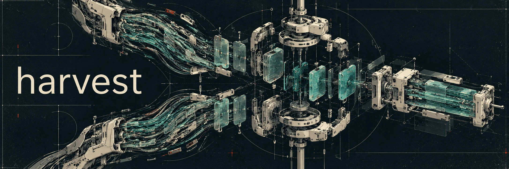

# harvest



**Turn a fork's 20,000-line diff into a list of features a human can actually review, then bring the ones you want upstream.**

Someone forks a repo and builds on it for months. Upstream would like some of that work, but `git diff upstream/main fork/main` is a wall of code nobody will read, and the fork's commit history tells the story in the order it happened, not the order that makes sense. Most of the time, the work never makes it back.

`harvest` is an [agent skill](https://agentskills.io) that sits between the two. The agent reads the whole diff and writes a **ledger**: one entry per feature, in plain language, each judged against upstream's own rules. You read the ledger, question the entries you care about, pick what to bring over, and choose how each one lands. The agent does the code work; you make every decision.

It works on any two diverged refs, not just forks: a long-lived branch against `main` is the same problem.

```
  fork/main ──┐                                      ┌── harvest/retry-webhooks
              ├─▶ 1 Fix points ─▶ 2 Ledger ─▶ 3 You ─▶ 4 Land ──┼── harvest/rate-limits
upstream/main ┘   (what's new?)   (features)  (pick)            └── harvest/audit-log
```

## Quick start

```
/harvest <base-ref> <head-ref> [fresh]
```

- **base**: where the work should land (`upstream/main`, or `main`).
- **head**: where the work lives now (the fork, or the long-lived branch).
- **fresh**: start a new ledger even if one already exists.

That's the Claude Code form. Installed as a Claude Code plugin, it's `/harvest:harvest`. In other agents, invoke the skill however your agent does, or just ask: "harvest `origin/main` into `upstream/main`".

Run it from inside a clone that has both refs:

```bash
git remote add upstream git@github.com:acme/webhooks.git
git fetch upstream
```

```
/harvest upstream/main origin/main
```

## What a session looks like

Here is an abbreviated session on a fictional fork of a webhook service, 9,400 lines ahead of upstream.

**1. The agent works out what's actually new.**

> Base `upstream/main`, head `origin/main`, merge-base `3f2a91c`. 61 commits, 48 files, +9,412 / −203.
>
> Set aside as already on base: 4 commits. Your rate-limiter PR was rebuilt and merged upstream last month, then merged back into the fork, so its original commits still show up in the log but their code is already upstream (pass 2).
>
> Yardstick: `CONTRIBUTING.md`, `CLAUDE.md`, `docs/adr/` (7 ADRs), `GLOSSARY.md`. Head rules: `FORK.md` says deployment config stays fork-only.

**2. It presents the ledger.**

> | # | Feature | Fit | Depends on |
> |---|---|---|---|
> | F1 | Delivery attempts recorded per webhook | aligned | none |
> | F2 | Retry failed deliveries with backoff | tension: adds a background thread; ADR-004 says the worker is single-threaded | F1 |
> | F3 | Signed payloads (HMAC header) | aligned | none |
> | F4 | Admin page for failed deliveries | tension: upstream has no web UI | F1, F2 |
> | Plumbing | Dependency bumps, CI cache | aligned | none |
> | Head-only | Fork docs, deploy scripts | conflict: FORK.md keeps these off upstream | none |

Each entry in the ledger file carries more: a description, the fork's own stated reason, size, commits, files, and notes from your questions.

**3. You question it, in plain language.**

> **You:** Does F2 really need its own thread? How would upstream build it?
>
> **Agent:** The thread only runs the backoff timer (`retry.py:40-88`). Upstream's worker already has a scheduled-job queue (`worker/jobs.py:12`); a retry could be a job that re-enqueues itself with a delay. That keeps ADR-004 intact. I've added this to F2's notes.

Then you pick:

> **You:** F1 and F3 cherry-pick. F2 rework, using the job queue. F4 rebuild, but as a CLI command instead of a web page. Leave the rest. Put F1 and F2 together in one batch called `retries`.

**4. It lands each batch on its own branch, and checks it.**

> `harvest/retries`: F1 cherry-picked (2 commits, 1 conflict resolved: upstream renamed `Delivery.status`), F2 reworked onto the job queue. Upstream's tests, linters and type checks pass. `test_retries_end_to_end` fails on upstream and passes here. Nothing from F3 or F4 is in the diff.
>
> `harvest/signed-payloads-hmac-header`: F3 cherry-picked cleanly.
>
> `harvest/admin-page-for-failed`: F4 rebuilt from a brief you approved, by a fresh agent that only had upstream's code.
>
> Ready to push. Want me to open PRs?

Nothing is pushed or opened without your go-ahead.

## The three landing modes

| Mode | Use it when | What happens |
|---|---|---|
| **cherry-pick** | The fork's code is already right for upstream. | Its commits are applied as written. Conflicts are explained (where each side came from) and resolved, asking you when two intents genuinely compete. Mentions of features you didn't pick are cut. |
| **rework** | The idea is right but the design doesn't fit upstream. | The agent proposes a design that fits upstream's rules and gets your agreement, then rewrites the feature using the fork's code and tests as a reference for behaviour. |
| **rebuild** | You want the behaviour, but not the code, or you want more than the fork built. | The agent writes a brief (intent, behaviour to keep, your additions, an acceptance test) for you to approve. A fresh agent then implements it test-first, in a clone that contains only upstream, so it can't copy the fork. |

By default each feature lands on its own branch, so upstream reviews one idea at a time. You can group features into named batches instead.

Every landing has to pass the same checks:
- upstream's own tests, linters and type checks;
- a test that drives the feature through upstream's public surface, fails on upstream (on an assertion, not an import error) and passes on the branch, deterministically;
- nothing from features you didn't pick.

## Batched review page

On a big ledger, deciding features one chat message at a time is slow. When the agent shows you the ledger, it offers a review page instead: a single offline HTML file it can open in your browser. Go through the entries in dependency order, mark each one cherry-pick, rework, rebuild or leave, name batches, and queue your questions. The page flags any pick whose dependency you left, and shows the branches it would land. When you're done, **Finish round** copies the whole round, and you paste it into the chat with your agent.

The agent checks the round against the ledger, applies your marks, answers every question in one pass, and gives you the next round's page with the answers inline. The ledger stays the record: the page is generated from it and never edits it. Nothing about the page is required. Turn it down and the session stays in chat as before.

In a cloud session, the agent sends you the file to open in your browser. It publishes the page somewhere only if you ask, since the page summarises unreleased work. Verified in current Chromium and Firefox, on desktop and at phone size. Safari and screen readers are untested.

## Stopping and resuming

The ledger is saved at `.git/harvest/<head>.md`, inside `.git`, so it persists across sessions without touching your working tree. Run `/harvest` again with the same refs and it tells you what it found before doing anything:

> Earlier state found: `.git/harvest/origin-main.md`, updated 2026-10-02 16:40, built from head `8c1d2e0`. 4 features: 1 open, 1 picked, 1 left, 1 landed (`harvest/retries` still exists). Resume or start fresh?

- **resume** keeps your picks and notes, adds any commits the head gained since, and re-checks what's already upstream. Carried-over items are marked `(earlier)` and new ones `(new: <commits>)`. If a new commit belongs to a feature you've already landed, it says so and offers to land it on top.
- **fresh** overwrites the ledger. Pass `fresh` as the third argument to choose it up front.

## How it stays accurate

A ledger is only useful if nothing gets lost or double-counted. The skill ships [`scripts/ledger_check.py`](scripts/ledger_check.py), which the agent runs rather than reasoning about git history by eye:

| Command | Checks |
|---|---|
| `survivors <base> <head>` | Which head commits are already upstream, including work that was rebuilt rather than cherry-picked, and which were later rewritten by the fork itself. |
| `coverage <base> <head> <owners.json>` | Every line the fork adds belongs to exactly one feature, every commit is accounted for, and nothing marked "already upstream" is actually missing from upstream. |
| `batch <base> <branch> <commit>...` | A cherry-picked branch contains only the lines its own commits wrote, plus listed conflict resolutions. |

Ownership is tracked per line, using `git blame`, in a sidecar file beside the ledger (`<head>.owners.json`).

The checker proves the ledger is complete and consistent. Whether commits are grouped by the right intent is a judgement, and questioning the ledger in step 3 is where that judgement gets tested. In testing, questions regularly caught code filed under the wrong feature.

## Requirements

- A coding agent that supports [Agent Skills](https://agentskills.io) and can run shell commands.
- The skill installed, either way:
  - `npx skills add cwade12c/spicerack --skill harvest`, for any supported agent;
  - or, in Claude Code, `/plugin marketplace add cwade12c/spicerack` and `/plugin install harvest@spicerack`.

  More options are in the [repo README](../../README.md).
- `git` and `python3`; the checker uses only the standard library.
- Both refs fetched into one local clone.
- For rebuild hand-offs, an agent that can dispatch subagents. Without one, the agent implements the rebuild itself and says so.

In Claude Code, harvest is user-invoked: it only runs when you type it, and it costs nothing in context otherwise. Other agents may also start it on their own when a request matches its description.

## Limits

- It's built for diffs too big to review directly. On a few hundred lines it works, but a normal PR review is quicker.
- Removed lines get one owner per file, chosen by judgement.
- Landing runs upstream's checks, so you need upstream's toolchain installed locally.

## Files

| File | For |
|---|---|
| [`SKILL.md`](SKILL.md) | The agent: steps 1–4, ledger format, done-checks. |
| [`references/LANDING.md`](references/LANDING.md) | The agent: the three landing modes and their checks, loaded only at step 4. |
| [`scripts/ledger_check.py`](scripts/ledger_check.py) | The agent: mechanical checks for set-aside, coverage, and batches. |
| [`references/REPORT.md`](references/REPORT.md) | The agent: the review page round by round (render, deliver, check, ingest, close), and the responses file format. Loaded only when you ask for the page. |
| [`scripts/report.py`](scripts/report.py) | The agent: renders the review page from the ledger, and checks a responses file against the ledger before it's applied. |
| [`assets/report-template.html`](assets/report-template.html) | The review page itself: one offline file with no dependencies, filled in by `report.py`. |
| `README.md` | You. |

The page's end-to-end tests are in [`tests/harvest/`](../../tests/harvest/) at the repo root. They aren't part of the installed skill.
